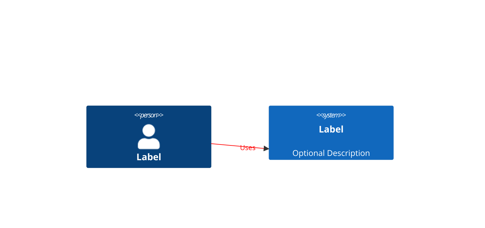
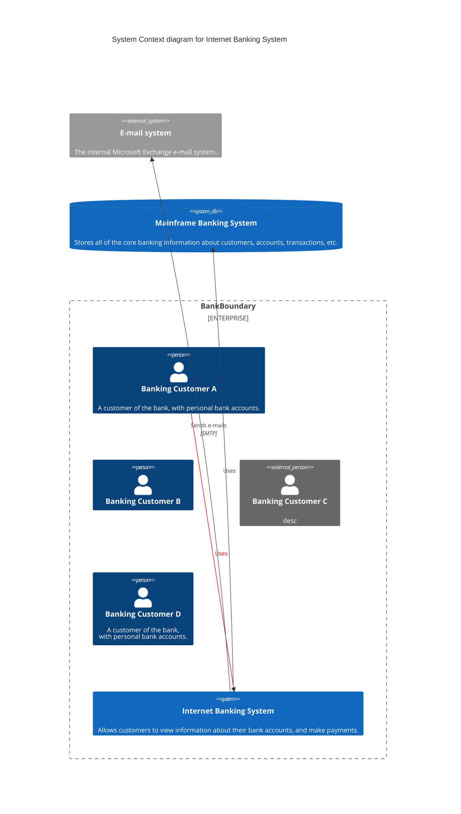
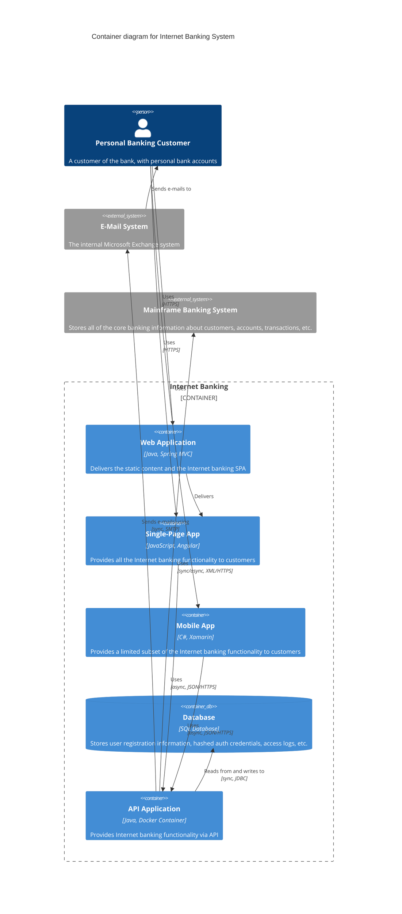

# Mermaid C4 Diagram Implementation

## Overview
Mermaid's C4 diagram implementation is an experimental feature that provides a simplified approach for creating C4 architecture diagrams. It follows a syntax compatible with PlantUML while using Mermaid's rendering engine.

## Status
- Currently marked as **experimental**
- Syntax may change in future releases
- Core C4 concepts are supported, but with some limitations

## Supported Diagram Types
1. System Context diagrams
2. Container diagrams
3. Component diagrams
4. Dynamic diagrams
5. Deployment diagrams

## Key Features

### Syntax Structure

### Element Types
- **Person**: External or internal users of the system
- **System**: External software systems interacting with the target system
- **Container**: Applications or data stores in the system
- **Component**: Internal components of containers
- **Boundary**: Groups elements together (System, Enterprise, Container)

### Relationship Definition
- Simple relationship syntax using `Rel()` function
- Direction can be controlled by element placement in the code
- Style customization available with `UpdateRelStyle()`

## Limitations
- No support for sprites/icons
- No support for tags
- No support for links
- No legend support
- No layout direction commands
- Fixed styling with consistent CSS colors
- More limited styling options compared to PlantUML

## Implementation Examples

### Basic System Context Example

### Container Example

## Practical Considerations
- Element positioning is determined by statement order
- Adjust layout by changing the sequence of element declarations
- Use descriptive aliases to make relationship definitions clearer
- Style updates can be applied after defining elements and relationships

## Resources
- Official documentation: [Mermaid C4 Diagrams](https://mermaid.js.org/syntax/c4.html)
- C4 Model reference: [C4 Model by Simon Brown](https://c4model.com/)